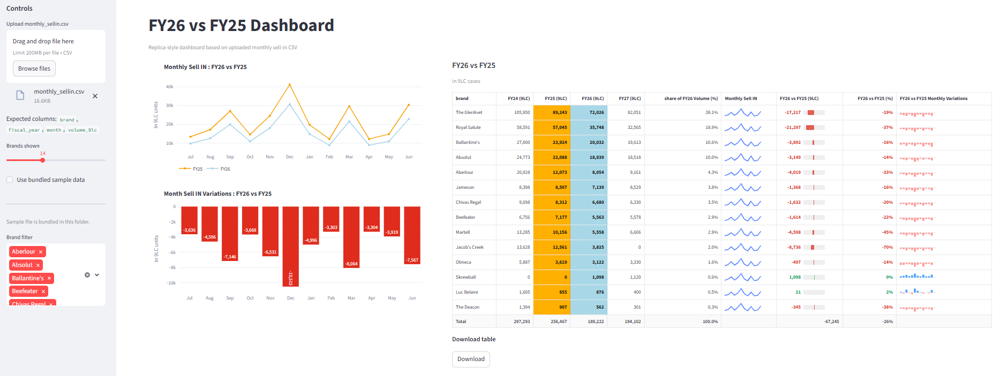

# FY26 vs FY25 Dashboard

This project is a Python-based Streamlit data product migrated from an R Shiny application. It provides a standardized and interactive way to analyze sell-in performance across fiscal years.

## Dashboard Preview

Note: The data shown in this screenshot is sample data for demonstration purposes only and does not represent actual business data.

---

## Files

- app.py
- monthly_sellin.csv
- requirements.txt

---

## How to run

1. Install dependencies

## Live Application

The application is publicly accessible at:

https://ws-forecast-tracker-w96mrjqr47k2zy5htvgrmk.streamlit.app/

## Sample Data

This repository includes a sample dataset (`monthly_sellin.csv`) to demonstrate the functionality of the application.

The dataset is synthetically generated and does not represent real business data. It is intended solely for testing and illustration purposes.
